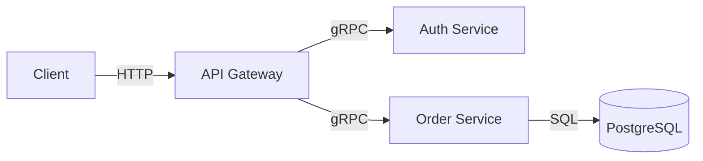
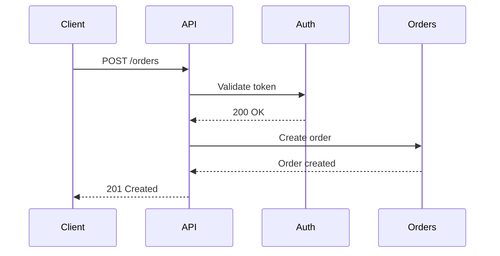
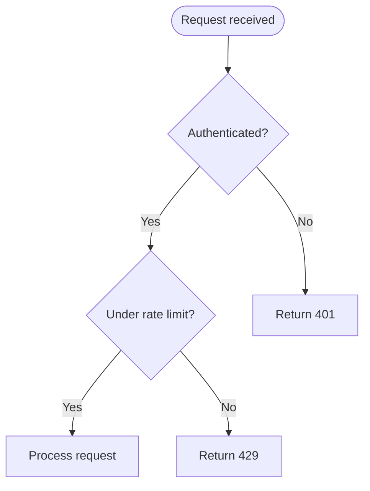
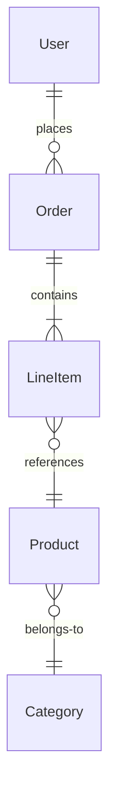
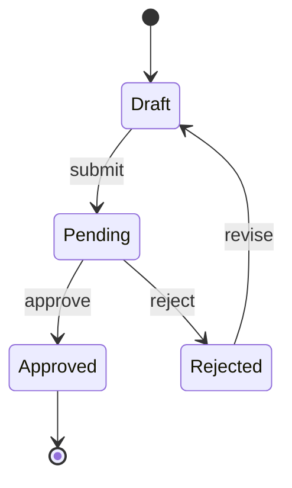

# Diagram Patterns Reference

Mermaid syntax quick reference, examples, and common mistakes. Use Mermaid for all diagrams in documentation — it's version-controllable, diffable, and renders in GitHub/GitLab/most doc platforms.

---

## Architecture Diagram (Flowchart)

**Use when:** Showing system components and their connections (> 3 components).

**Alt-text pattern:** "Architecture diagram showing [system name]: [list key components and their connections in reading order]."

---

## Sequence Diagram

**Use when:** Showing request/response flow between services (> 2 actors).

**Alt-text pattern:** "Sequence diagram showing [process name]: [actor] sends [what] to [actor], which responds with [what]."

---

## Flowchart (Decision Logic)

**Use when:** Showing decision logic or process steps (> 3 decision points).

**Alt-text pattern:** "Flowchart showing [process name]: starts with [entry], branches at [decision points], ends at [outcomes]."

---

## ER Diagram

**Use when:** Showing data model relationships.

**Alt-text pattern:** "Entity relationship diagram showing [domain]: [entity] has [relationship] with [entity]."

---

## State Diagram

**Use when:** Showing the lifecycle of an entity.

**Alt-text pattern:** "State diagram showing [entity] lifecycle: starts as [initial state], transitions through [key states] via [key actions]."

---

## Common Mistakes

| Mistake | Problem | Fix |
|---|---|---|
| Too many nodes (> 15) | Diagram becomes unreadable | Split into sub-diagrams, one per subsystem |
| Unlabelled arrows | Reader can't tell what flows between components | Label every arrow with data or action |
| Missing legend | Reader can't distinguish node types | Add a legend when using > 5 element types |
| Too wide | Horizontal scroll breaks flow | Use `TD` (top-down) layout or split diagram |
| No alt-text | Inaccessible to screen readers | Add descriptive alt-text using patterns above |
| Mixing detail levels | Architecture and implementation in one diagram | Separate high-level overview from detailed views |

---

## Mermaid Syntax Quick Reference

| Element | Syntax | Example |
|---|---|---|
| Rectangle node | `A[Label]` | `API[API Gateway]` |
| Rounded node | `A(Label)` | `Start(Begin)` |
| Stadium node | `A([Label])` | `Start([Request])` |
| Diamond (decision) | `A{Label}` | `Check{Valid?}` |
| Database | `A[(Label)]` | `DB[(PostgreSQL)]` |
| Arrow with label | `A -->|label| B` | `A -->|HTTP| B` |
| Dotted arrow | `A -.-> B` | Response arrows |
| Direction LR | `flowchart LR` | Left to right |
| Direction TD | `flowchart TD` | Top to bottom |
