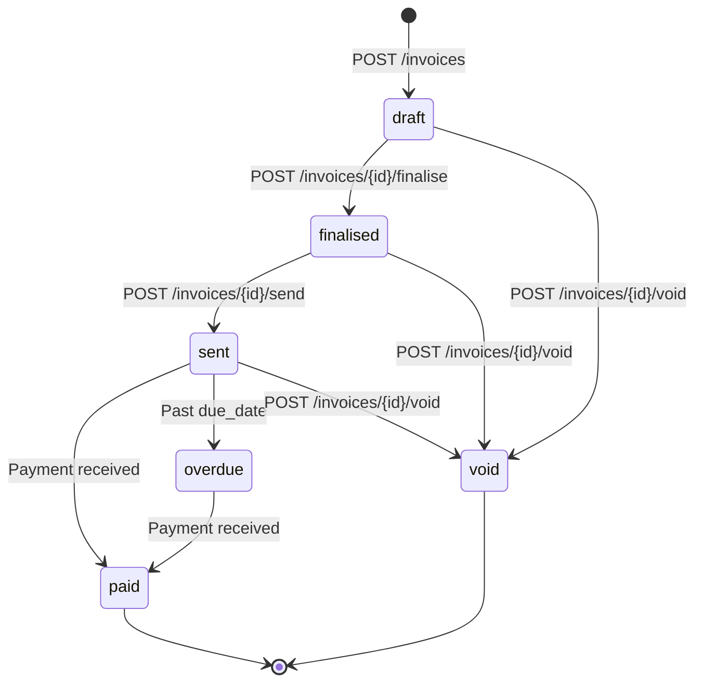

# POST /api/v1/invoices

Create a new invoice with one or more line items.

Use this endpoint to generate invoices for customers after goods are delivered or services rendered. The invoice is created in `draft` status and must be explicitly finalised before it can be sent or marked as payable.

---

## Authentication

All requests require a Bearer token in the `Authorization` header.

```
Authorization: Bearer <your-api-key>
```

API keys are scoped per environment. Use your **test** key (prefixed `sk_test_`) during development and your **live** key (prefixed `sk_live_`) in production. Requests without a valid token return `401 Unauthorized`.

---

## Request

```
POST /api/v1/invoices
Content-Type: application/json
```

### Headers

| Header | Required | Description |
|---|---|---|
| `Authorization` | Yes | `Bearer <api-key>` |
| `Content-Type` | Yes | Must be `application/json` |
| `Idempotency-Key` | No | Unique string (UUID recommended) to prevent duplicate invoice creation on retries. Keys expire after 24 hours. |

### Request Body

```json
{
  "customer_id": "cus_8a3b1c2d",
  "currency": "AUD",
  "due_date": "2026-05-15",
  "line_items": [
    {
      "description": "Web development — April 2026",
      "quantity": 40,
      "unit_price": 15000,
      "tax_rate_id": "txr_gst_10"
    },
    {
      "description": "Hosting (monthly)",
      "quantity": 1,
      "unit_price": 4900
    }
  ],
  "notes": "Payment due within 30 days of invoice date.",
  "metadata": {
    "project_id": "proj_website_redesign",
    "po_number": "PO-2026-0042"
  }
}
```

### Fields

| Field | Type | Required | Description |
|---|---|---|---|
| `customer_id` | string | Yes | ID of the customer to invoice. Must reference an existing customer. |
| `currency` | string | Yes | Three-letter ISO 4217 currency code (e.g. `AUD`, `USD`, `GBP`). |
| `due_date` | string | No | Payment due date in `YYYY-MM-DD` format. Defaults to 30 days from creation if omitted. |
| `line_items` | array | Yes | One or more line items. Minimum 1, maximum 250. |
| `notes` | string | No | Free-text notes displayed on the invoice. Max 2000 characters. |
| `payment_terms` | string | No | One of `net_7`, `net_14`, `net_30`, `net_60`, `net_90`, `due_on_receipt`. Overrides `due_date` if both are provided. |
| `metadata` | object | No | Key-value pairs for your own record-keeping. Max 20 keys, 500 chars per key, 2000 chars per value. Not displayed on the invoice. |

### Line Item Fields

| Field | Type | Required | Description |
|---|---|---|---|
| `description` | string | Yes | What the line item is for. Max 500 characters. |
| `quantity` | number | Yes | Quantity of units. Must be > 0. Supports up to 4 decimal places (e.g. `1.5` hours). |
| `unit_price` | integer | Yes | Price per unit **in the currency's smallest unit** (e.g. cents). `15000` = $150.00 AUD. Must be ≥ 0. |
| `tax_rate_id` | string | No | ID of a tax rate to apply to this line item. If omitted, no tax is applied to this item. |
| `discount_percent` | number | No | Percentage discount on this line item. Range: `0`–`100`. Applied before tax. |

---

## Response

### Success — `201 Created`

```json
{
  "id": "inv_7f2e9a4b",
  "object": "invoice",
  "status": "draft",
  "customer_id": "cus_8a3b1c2d",
  "currency": "AUD",
  "invoice_number": "INV-2026-0087",
  "issue_date": "2026-04-06",
  "due_date": "2026-05-15",
  "line_items": [
    {
      "id": "li_a1b2c3d4",
      "description": "Web development — April 2026",
      "quantity": 40,
      "unit_price": 15000,
      "tax_rate_id": "txr_gst_10",
      "tax_amount": 60000,
      "discount_percent": 0,
      "subtotal": 600000,
      "total": 660000
    },
    {
      "id": "li_e5f6g7h8",
      "description": "Hosting (monthly)",
      "quantity": 1,
      "unit_price": 4900,
      "tax_rate_id": null,
      "tax_amount": 0,
      "discount_percent": 0,
      "subtotal": 4900,
      "total": 4900
    }
  ],
  "subtotal": 604900,
  "tax_total": 60000,
  "total": 664900,
  "amount_due": 664900,
  "notes": "Payment due within 30 days of invoice date.",
  "metadata": {
    "project_id": "proj_website_redesign",
    "po_number": "PO-2026-0042"
  },
  "created_at": "2026-04-06T09:32:17Z",
  "updated_at": "2026-04-06T09:32:17Z"
}
```

### Response Fields

| Field | Type | Description |
|---|---|---|
| `id` | string | Unique invoice ID. |
| `object` | string | Always `"invoice"`. |
| `status` | string | Invoice lifecycle state. Newly created invoices are always `draft`. |
| `invoice_number` | string | Sequential, human-readable invoice number. Auto-generated. |
| `issue_date` | string | Date the invoice was created (`YYYY-MM-DD`). |
| `subtotal` | integer | Sum of all line item subtotals before tax, in smallest currency unit. |
| `tax_total` | integer | Sum of all tax amounts across line items. |
| `total` | integer | `subtotal + tax_total`, in smallest currency unit. |
| `amount_due` | integer | Outstanding balance. Equals `total` on creation. Decreases as payments are applied. |
| `created_at` | string | ISO 8601 timestamp. |
| `updated_at` | string | ISO 8601 timestamp. |

---

## Errors

| Status | Code | Cause | Fix |
|---|---|---|---|
| `400` | `invalid_request` | Request body failed validation (missing fields, wrong types, empty `line_items`). | Check the `errors` array in the response for field-level details. |
| `401` | `unauthorized` | Missing or invalid API key. | Verify your `Authorization` header and key prefix (`sk_test_` vs `sk_live_`). |
| `404` | `customer_not_found` | `customer_id` does not match an existing customer. | Verify the customer exists via `GET /api/v1/customers/{id}`. |
| `404` | `tax_rate_not_found` | A `tax_rate_id` in `line_items` does not exist. | List valid tax rates via `GET /api/v1/tax-rates`. |
| `409` | `duplicate_request` | An invoice was already created with this `Idempotency-Key`. | The response body contains the original invoice. Safe to use as-is. |
| `422` | `unprocessable_entity` | Request is well-formed but violates a business rule (e.g. customer is archived). | Check the `message` field for the specific rule that was violated. |
| `429` | `rate_limited` | Too many requests. Default limit: 100 requests/minute per API key. | Back off and retry after the `Retry-After` header (seconds). |

### Error Response Shape

```json
{
  "error": {
    "code": "invalid_request",
    "message": "line_items[0].unit_price must be an integer (cents). Received: 150.00",
    "errors": [
      {
        "field": "line_items[0].unit_price",
        "message": "Must be an integer representing the smallest currency unit.",
        "code": "invalid_type"
      }
    ]
  }
}
```

---

## Code Examples

### curl

```bash
curl -X POST https://api.example.com/api/v1/invoices \
  -H "Authorization: Bearer sk_test_abc123" \
  -H "Content-Type: application/json" \
  -H "Idempotency-Key: 550e8400-e29b-41d4-a716-446655440000" \
  -d '{
    "customer_id": "cus_8a3b1c2d",
    "currency": "AUD",
    "due_date": "2026-05-15",
    "line_items": [
      {
        "description": "Web development — April 2026",
        "quantity": 40,
        "unit_price": 15000,
        "tax_rate_id": "txr_gst_10"
      }
    ]
  }'
```

### Python

```python
import requests

response = requests.post(
    "https://api.example.com/api/v1/invoices",
    headers={
        "Authorization": "Bearer sk_test_abc123",
        "Idempotency-Key": "550e8400-e29b-41d4-a716-446655440000",
    },
    json={
        "customer_id": "cus_8a3b1c2d",
        "currency": "AUD",
        "due_date": "2026-05-15",
        "line_items": [
            {
                "description": "Web development — April 2026",
                "quantity": 40,
                "unit_price": 15000,
                "tax_rate_id": "txr_gst_10",
            }
        ],
    },
)

invoice = response.json()
print(f"Invoice {invoice['invoice_number']} created — total: ${invoice['total'] / 100:.2f}")
```

### TypeScript (fetch)

```typescript
const response = await fetch("https://api.example.com/api/v1/invoices", {
  method: "POST",
  headers: {
    "Authorization": "Bearer sk_test_abc123",
    "Content-Type": "application/json",
    "Idempotency-Key": crypto.randomUUID(),
  },
  body: JSON.stringify({
    customer_id: "cus_8a3b1c2d",
    currency: "AUD",
    due_date: "2026-05-15",
    line_items: [
      {
        description: "Web development — April 2026",
        quantity: 40,
        unit_price: 15000,
        tax_rate_id: "txr_gst_10",
      },
    ],
  }),
});

const invoice = await response.json();
console.log(`Invoice ${invoice.invoice_number} created — total: $${(invoice.total / 100).toFixed(2)}`);
```

---

## Invoice Lifecycle



---

## Notes

- **Monetary values** are always integers in the currency's smallest unit (cents for AUD/USD, pence for GBP). Never pass decimals — `15000` means $150.00, not $15,000.
- **Idempotency**: If you retry a request with the same `Idempotency-Key`, you'll get the original invoice back with a `409` status. Always use idempotency keys for production integrations to avoid duplicate invoices on network retries.
- **Tax calculation**: Tax is applied per line item, not on the invoice total. Each line item's tax is calculated as `subtotal × tax_rate`, rounded to the nearest cent.
- **Draft invoices** can be edited freely via `PATCH /api/v1/invoices/{id}`. Once finalised, an invoice is immutable — void it and create a new one to make changes.
